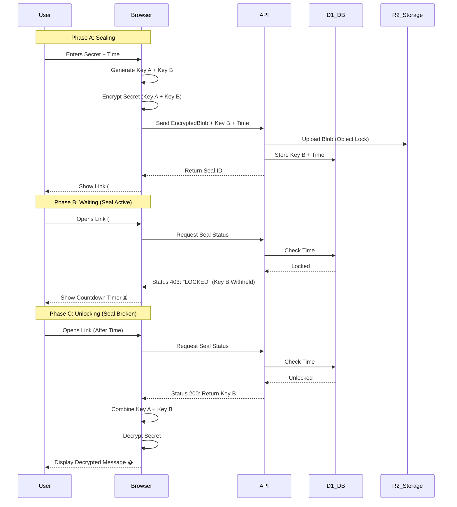

<div align="center">

# ⏳ TIME-SEAL
### The Unbreakable Protocol


```text
████████╗██╗███╗   ███╗███████╗    ███████╗███████╗ █████╗ ██╗
╚══██╔══╝██║████╗ ████║██╔════╝    ██╔════╝██╔════╝██╔══██╗██║
   ██║   ██║██╔████╔██║█████╗█████╗███████╗█████╗  ███████║██║
   ██║   ██║██║╚██╔╝██║██╔══╝╚════╝╚════██║██╔══╝  ██╔══██║██║
   ██║   ██║██║ ╚═╝ ██║███████╗    ███████║███████╗██║  ██║███████╗
   ╚═╝   ╚═╝╚═╝     ╚═╝╚══════╝    ╚══════╝╚══════╝╚═╝  ╚═╝╚══════╝
```

### *"If I go silent, this speaks for me."*

[Create a Seal](http://localhost:3000) · [View Architecture](#-architecture) · [Report Bug](https://github.com/teycir/timeseal/issues)

</div>

---

## ⚡ Overview

**TIME-SEAL** is a cryptographically enforced time-locked vault system built on Cloudflare's edge infrastructure. It allows you to encrypt a file or message that **mathematically cannot be opened** until a specific moment in the future.

### Why is this different?
> most "future message" apps contain "trust me bro" promises. Time-Seal is **Cryptographically Enforced** at the Edge.

---

## 🏗️ Architecture

<div align="center">
  <h3>Zero-Trust • Edge-Native • Unbreakable</h3>
</div>

### 🔒 Layer 1: The Vault (R2 Object Lock)
> **Immutable Storage**
Files are stored in Cloudflare R2 with **WORM Compliance** (Write Once, Read Many). This prevents deletion—even by the admin—until the unlock time expires.

### 🤝 Layer 2: The Handshake (Split-Key Crypto)
> **Trust-Minimized**
We use a Split-Key architecture to ensure no single party can decrypt the data early.
*   **Key A (User):** Stored in the URL hash. Never sent to the server.
*   **Key B (Server):** Stored in D1 database inside the secure enclave.
*   **The Check:** The server refuses to release Key B until `Now > Unlock_Time`.

### 💓 Layer 3: The Pulse (Dead Man's Switch)
> **Automated Release**
If used as a Dead Man's Switch, the user must click a private "Pulse Link" periodically. If they fail to check in, the seal unlocks automatically for the recipient.

---

## 🧠 Logic Flow



---

## 🎯 Use Cases

| User Persona | Scenario |
| :--- | :--- |
| **💀 The Crypto Holder** | "I have my seed phrase in a Time-Seal. If I die, it unlocks for my wife after 30 days of silence. If I'm alive, I reset the timer." |
| **🕵️ The Whistleblower** | "I have evidence. If I am arrested and can't click the reset button, the evidence goes public automatically." |
| **🚀 The Marketer** | "I'm dropping a limited edition product. The link is public now, but nobody can buy until the timer hits zero." |

---

## � Tech Stack

*   **Frontend:** `Next.js 14` (App Router)
*   **Runtime:** `Cloudflare Workers`
*   **Database:** `Cloudflare D1` (SQLite)
*   **Storage:** `Cloudflare R2` (Object Lock)
*   **Crypto:** `Web Crypto API` (Native AES-GCM)
*   **Styling:** `Tailwind CSS` (Cipher-punk Theme)

---

## 🚀 Quick Start

```bash
# 1. Install dependencies
npm install

# 2. Run development server
npm run dev
```

Open [http://localhost:3000](http://localhost:3000) to create your first seal.

---

## 🔮 Future Roadmap

- [ ] **Multi-Sig Unlocking**: Require M-of-N keys to open.
- [ ] **Decentralized Storage**: Backup blobs to Arweave/IPFS.
- [ ] **Hardware Key Support**: Integration with YubiKey for Pulse.

---

<div align="center">

**Built with 💚 and 🔒**

*Time-Seal: Where cryptography meets inevitability.*

</div>